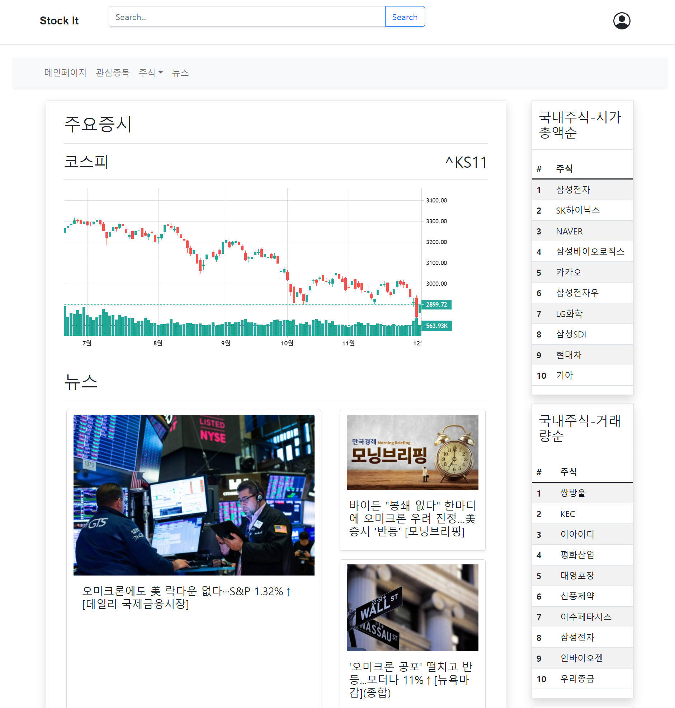
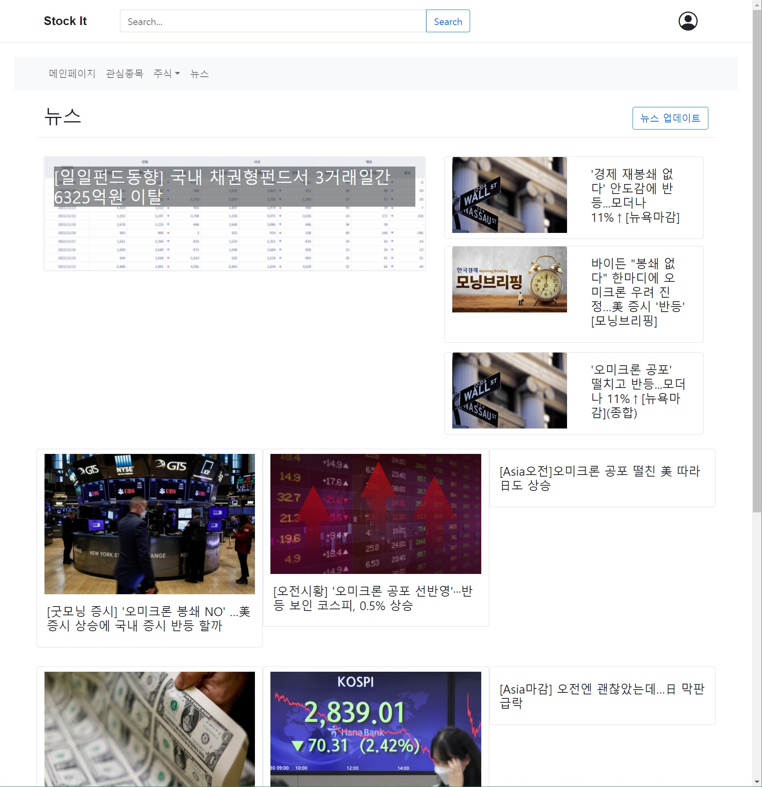
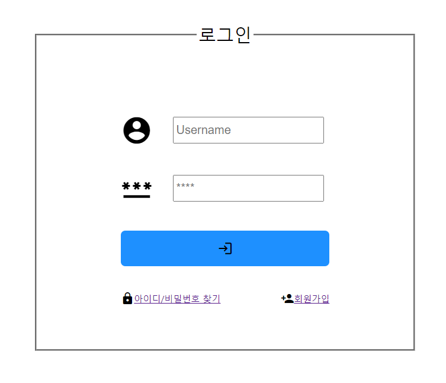
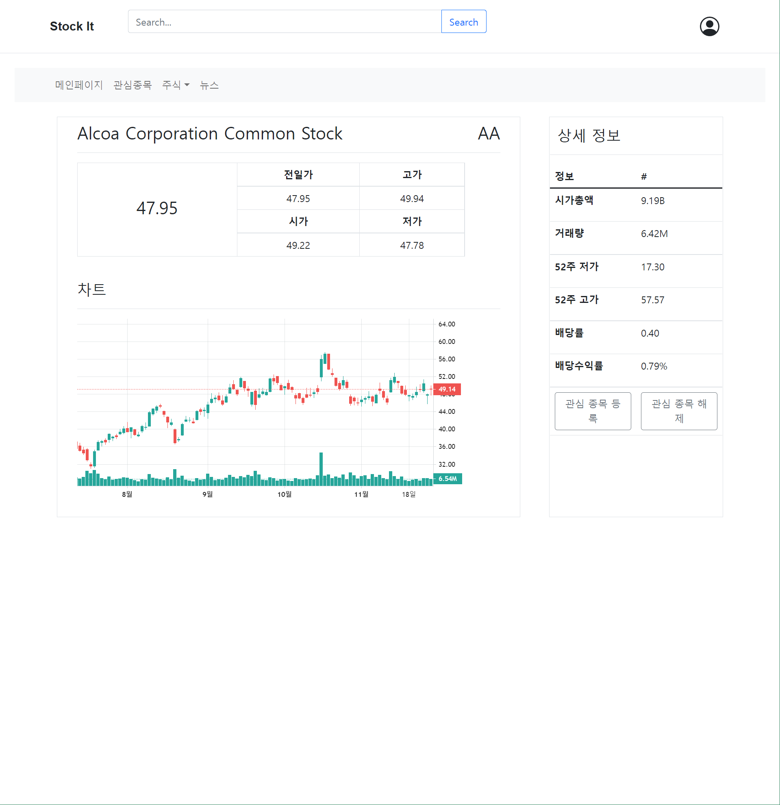
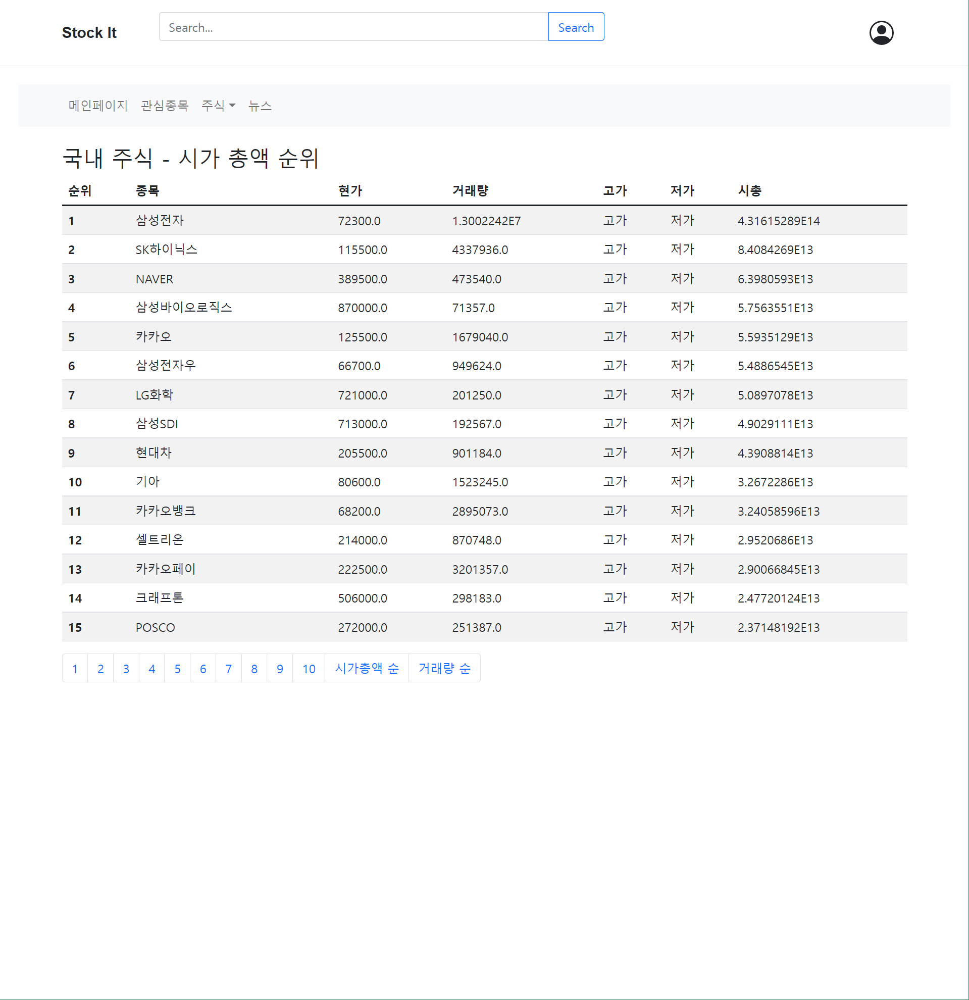
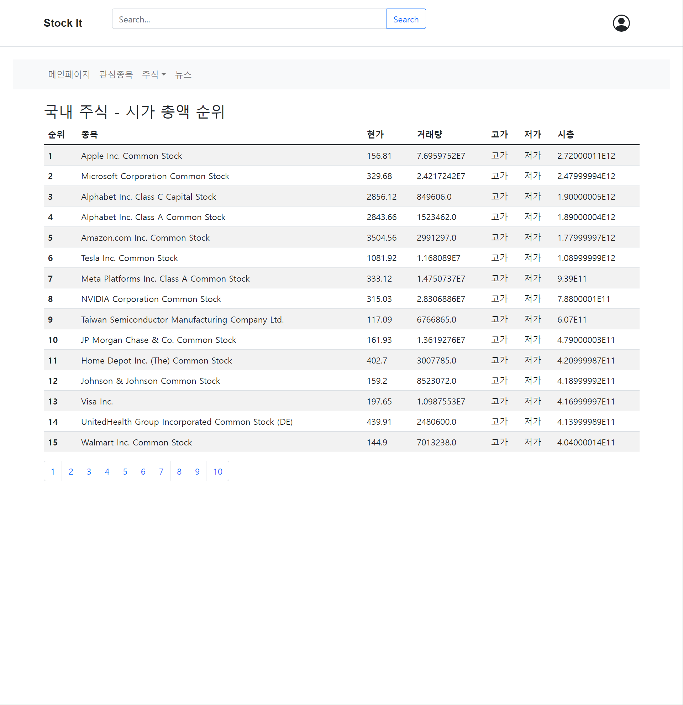

# StockIT
2021년도 2학기 웹프로그래밍_03 팀 프로젝트

## WorkFlow
Feature Branch Workflow를 따릅니다.  
개발시에 각 기능별 혹은 사용자별로 `branch`를 만들어서 개발을 진행하고, `Pull request`를 통해 병합을 진행합니다.  
`Main` 브랜치에 직접적으로 `commit`하는 것을 피해주세요.  
자세한 사항은 아래 링크를 참조해주세요 
- [Git Feature Branch Workflow](https://www.atlassian.com/git/tutorials/comparing-workflows/feature-branch-workflow)  
- [Git을 이용한 협업 워크플로우](https://lhy.kr/git-workflow)의 2절  

## Compatibility
  
  

## Import to Eclipse
File > import > General > Projects from Folder or Archive

## 환경설정
### mysql
mysql jdbc 드라이버 다운로드후 `mysql-connector-java-8.x.x.jar`를  
`StockIT/WebContent/WEB-INF/lib/` 디렉토리에 위치시키기
- [mysql Connector/J 8.0.27](https://dev.mysql.com/downloads/connector/j/)

### mail
메일인증 위한 라이브러리
mail-1.4.7.jar와 activation-1.1.jar 다운 받아서 
두 jar파일 'StockIT/WebContent/WEB-INF/lib/' 경로에 위치시키기
(https://heodolf.tistory.com/99)  잘 실행되는 mail.jar, activation.jar 다운 가능

### cos.jar
프로필 수정란에서 선택한 이미지를 프로젝트 폴더에 저장하고, 필요할 때 접근하기 위해  
'cos-xx.xx.zip를 다운 후, 압축 해제 후에 lib 폴더 안 'cos.jar'를 
`StockIT/WebContent/WEB-INF/lib/` 디렉토리에 위치시키기
- [cos-20.08.zip](http://www.servlets.com/cos/)

### jsoup
웹 페이지를 크롤링 하기 위한 라이브러리
jsoup-1.14.x.jar 파일을 다운로드 받고,   
파일을 `StockIT/WebContent/WEB-INF/lib/` 디렉토리에 위치시키기
- [jsoup hompage](https://jsoup.org)
- [jsoup-1.14.3.jar](https://jsoup.org/packages/jsoup-1.14.3.jar)

## 주식 차트
### 주식 api
rapid api의 YH Finance api를 사용하였음.  
우선 개인 계정으로 api 키를 발급받았는데 500 request/month 여서 api사용에 주의할것.  
만약 api 사용 회수가 한계에 가까워지면 프로젝트 제출시에 새 api키를 발급받아 수정해야 함.   
또 YH Finance api의 historical data가 과거 1년치의 데이터만을 제공하고 있는 듯 해서 그 이전의 그래프는 띄울 수 없음.   
[YH Finance api](https://rapidapi.com/apidojo/api/yh-finance/)   
### 주식 차트 사용법
`stock-chart.jsp`페이지를 삽입하고 파라미터 `width`, `height`, `ticker`를 설정한다.  
`width` : 차트 넓이  
`height`: 차트 높이  
`ticker`: 주식 종목 코드   

## 주식 세부정보
### 주식 api
주식 차트에 사용한 api와 다른 api 사용함.   
[Stock Data - Yahoo Finance Alternative](https://rapidapi.com/principalapis/api/stock-data-yahoo-finance-alternative/)
> api의 무료 request 횟수를 최대한 적게 사용하기 위해 api를 분산하여 사용함.   

- 기존 주식 세부정보 항목들중 상한가, 하한가의 경우 미국 주식에는 존재하지 않고 있어서 삭제함.
- 주식 차트를 일, 주, 년 등에 따라 변경하는 버튼 또한 차트에서 마우스 드래그 및 스크롤로 제공하는 기능이어서 제거함.
- 그 외에도 주식 세부정보중 api로 얻을수 있고, 실제 투자의 지표가 되는 항목들을 추가하고, 일부 항목 제거함  

## 메일인증
SMTPAuthenticator.java의 getPasswordAuthentication 메서드에 메일을 발송할 관리자의 메일과 비밀번호 작성필요

sendMail.jsp의 
String host = ""; 각자 구현한 웹사이트 주소 작성필요  
String from = ""; 메일을 발송할 메일주소 작성필요, gmail로만 메일 발송가능 

---
## 구현 화면
### 메인 페이지

### 뉴스 페이지

### 로그인 페이지

### 검색

### 주식 세부항목

### 국내주식

### 해외주식

